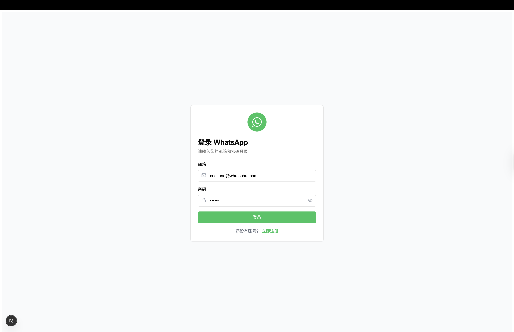
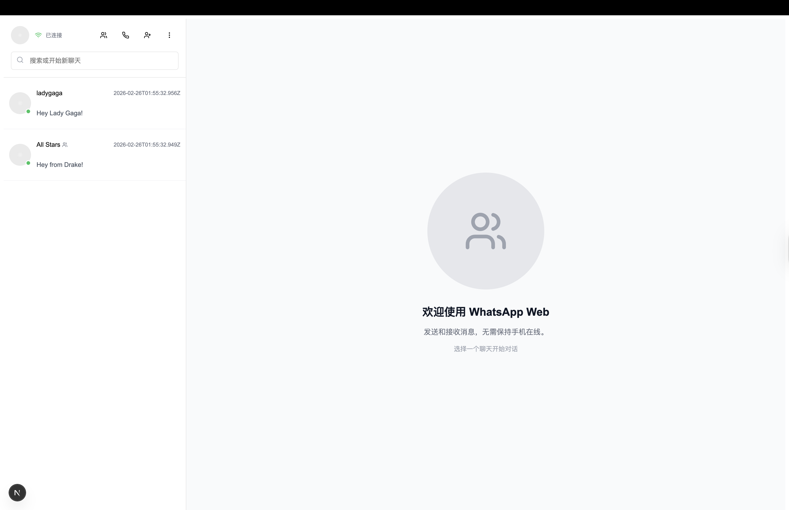
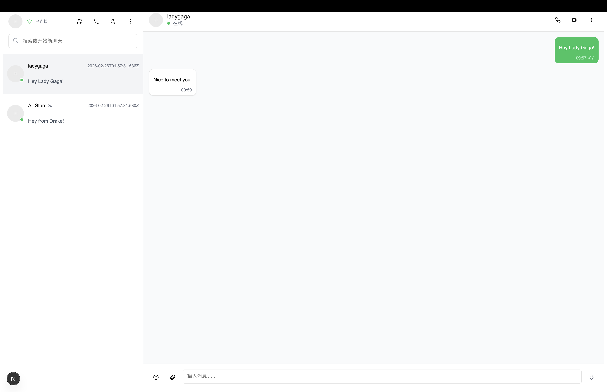
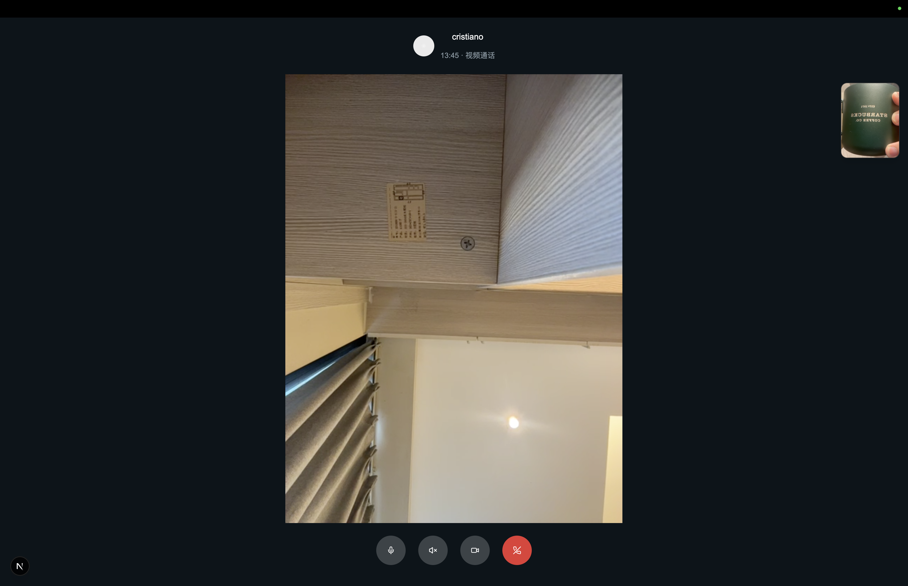
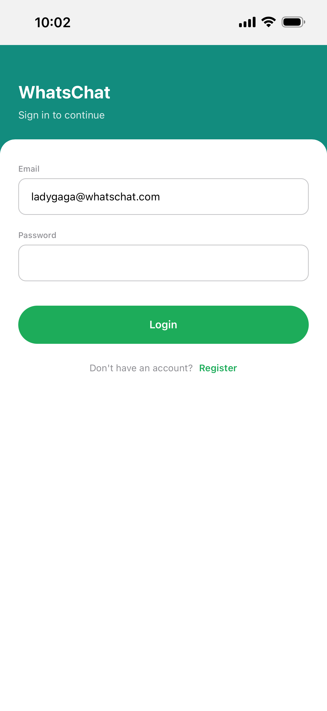
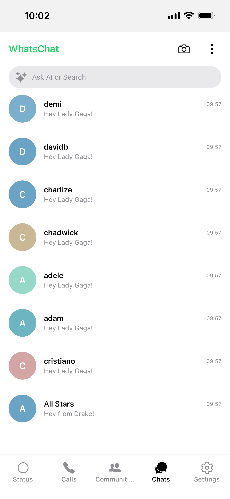
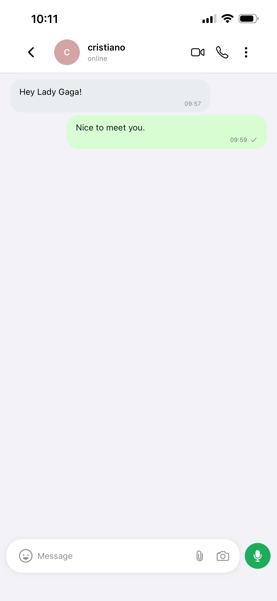
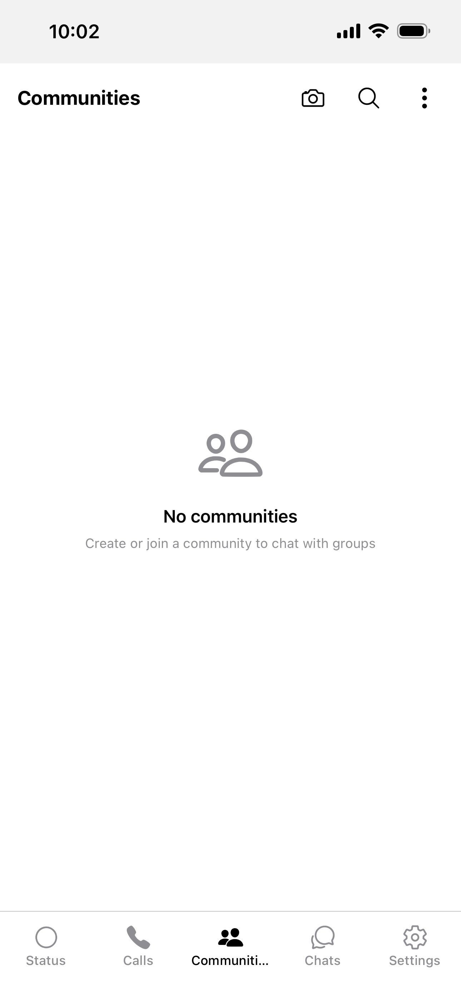
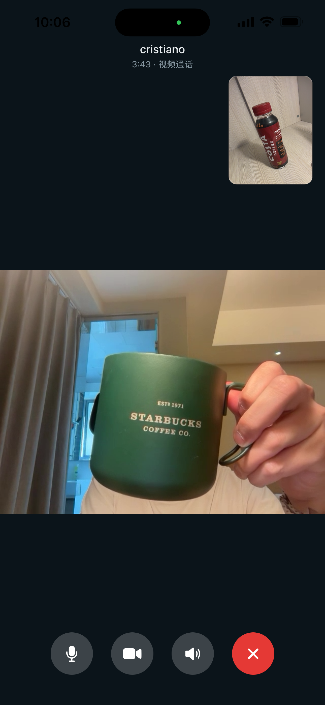
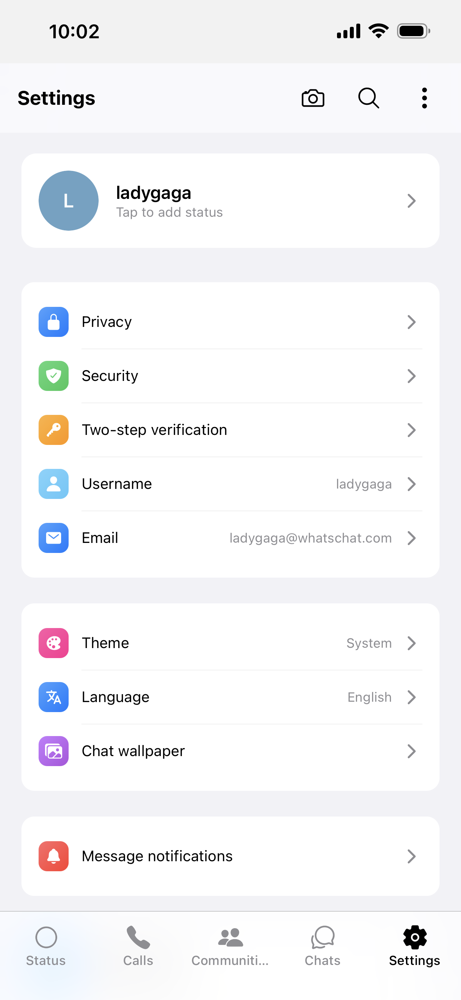

# WhatsChat

A modern instant messaging application with real-time chat, voice/video calls, and file sharing.

## ✨ Features

- 💬 **Real-time Chat** – Instant messaging with Socket.IO
- 📞 **Voice/Video Calls** – WebRTC-based audio and video
- 📎 **File Sharing** – Send images, documents, and media
- 👥 **Contact Management** – Add, search, and manage contacts
- 🔍 **Message Search** – Full-text search powered by Elasticsearch
- 🔐 **Authentication** – JWT-based auth with bcrypt
- 🌐 **Web App** – Next.js SPA on port 4000
- 📱 **Mobile App** – React Native + Expo
- ⚙️ **Admin Dashboard** – Management UI on port 4001

## 📸 Screenshots

### Web

| Login | Chat List | Chat | Video Call |
|:-----:|:---------:|:----:|:----------:|
|  |  |  |  |

### Mobile

| Login | Chats | Chat | Communities | Video Call | Settings |
|:-----:|:-----:|:----:|:-----------:|:----------:|:--------:|
|  |  |  |  |  |  |

### Admin

| Dashboard | Users |
|:---------:|:-----:|
|  |  |

## 🛠 Tech Stack

| Layer | Technologies |
|-------|--------------|
| Frontend | Next.js · React · TypeScript · Emotion · Redux Toolkit · Tailwind CSS |
| Mobile | React Native · Expo · Emotion · Redux Toolkit |
| Backend | NestJS · Prisma · PostgreSQL · Redis · Socket.IO |
| Search | Elasticsearch (optional) |
| Storage | Local file storage |

## 🚀 Quick Start

### Prerequisites

- Node.js 18+
- pnpm 8+
- Docker & Docker Compose (PostgreSQL, Redis, Kafka via `apps/server/docker-compose.yml`)

### Setup

```bash
pnpm install
pnpm setup
```

### Run

```bash
pnpm start:server    # Docker (postgres/redis/kafka) + NestJS API (:3001)
pnpm start:web       # Web app on :4000
pnpm start:admin     # Admin dashboard on :4001
pnpm start:mobile:ios   # or start:mobile:android
```

### Environment

- `apps/server/.env` – Copy from `env.example`
- `apps/web/.env.local` – Set `NEXT_PUBLIC_API_URL=http://localhost:3001/api/v1`
- `apps/admin/.env.local` – Set `NEXT_PUBLIC_API_URL=http://localhost:3001/api/v1`
- `ADMIN_EMAILS=admin@whatschat.com` (comma-separated) for admin access

## 📁 Project Structure

```
apps/
  web      # Next.js web app (:4000)
  admin    # Admin dashboard (:4001)
  mobile   # Expo mobile app
  server   # NestJS API (:3001)
packages/
  domain   # Shared types and constants
```

## 📚 Docs & Diagrams

- [文档索引](docs/README.md)
- [C4](docs/en/rd/c4/README.md): [系统上下文](docs/en/rd/c4/system-context.puml) · [容器](docs/en/rd/c4/containers.puml) · [API 组件](docs/en/rd/c4/components-api-server.puml)
- [TOGAF](docs/en/rd/togaf/overview.puml)

## 📄 License

MIT
