# WhatsChat

一个现代化即时通讯应用，支持实时聊天、音视频通话与文件共享。

## ✨ 功能特性

- 💬 **实时聊天** – 基于 Socket.IO 的即时消息（仅真实连接）
- 📞 **音视频通话** – 基于 WebRTC 的语音与视频通话
- 📎 **文件分享** – 发送图片、文档与媒体文件
- 👥 **联系人管理** – 添加、搜索与管理联系人
- 🔍 **消息搜索** – 基于 Elasticsearch 的全文检索
- 🔐 **身份认证** – 基于 JWT + bcrypt 的认证体系
- 🤖 **AI 文本** – 通过 Ollama 提供流式对话（可配置 base URL/model）
- 🖼️ **图片/视频/语音生成** – 自建 media-gen（Python/FastAPI, :3456）：图片（Stable Diffusion）、视频（CogVideoX）、语音（edge-tts）；或仅图片走 Replicate
- 📷 **动态与帖子** – 支持多图/视频 + 文案发帖；媒体先通过 `POST /api/v1/media/upload` 上传，再调用 `POST /api/v1/posts` 提交；视频封面单独存储在 Cassandra `coverUrl`（不混入 `mediaUrls`）；首页基于关注关系展示真实帖子（Cassandra + Kafka post.created）；`POST /api/v1/graphql` 一次请求获取 feed/reels + 帖子详情；Reels 与个人主页网格优先使用封面；Explore 网格最大宽度 963px 居中；动态与评论弹窗支持多媒体轮播；评论存储在 MongoDB
- 🧲 **广告系统** – 广告账户/活动/广告组/创意存储在 PostgreSQL；广告服务按定向与节奏将赞助内容混入 feed/explore；曝光/点击/转化通过 `@whatschat/analytics` 上报并聚合，用于报表与推荐
- 🛡️ **内容审核** – Vision 服务（Python/FastAPI, :8001）：图片/视频 NSFW 检测（NudeNet）、标签推荐（ResNet50）；发帖同步审核 + Kafka 异步链路；管理端支持复审、隐藏、批量删除
- 🔎 **全局搜索** – 基于 Elasticsearch 搜索帖子、用户、话题；支持游标分页与高亮；限流（60/min）；用户在注册/更新时入索引，话题在 post.created 后入索引；可选同步脚本 `pnpm run search:sync-users`
- 🎯 **推荐系统** – 关注推荐、互动排序 feed、探索流推荐；Python 推荐服务（LightFM、implicit ALS、Annoy）+ Celery worker；可选使用 Redis/Kafka/PostgreSQL/Cassandra 数据；ETL 会读取广告分析数据构建特征
- 👤 **社交能力** – 关注/取关、个人主页粉丝/关注数、列表弹窗无限滚动与行内关注操作
- 🌐 **Web 应用** – Next.js SPA（:4000）；Instagram 风格 UI（导航、feed、Reels、个人主页、全局搜索、通知抽屉、搜索抽屉、探索网格、私信、右侧推荐）；Redux 通知切片 + Socket.IO `notification:new`；i18n（中英切换）；信息流内联广告与点击追踪
- 📱 **移动端应用** – React Native + Expo（expo-router）；Instagram 风格 **Status**（Stories + 纵向 Feed + 横滑多媒体）、**Reels**、**Messages**（DM 列表与行样式）、**Search**（Explore 三列宫格 + Elasticsearch 帖子搜索，对接 `/posts/explore` 与 `/search`）、**Profile**（个人主页：顶栏、粉丝/关注/帖子、Discover、网格/Reels/标记 Tab、用户帖子 `/posts/user/:id`）；独立栈 **Settings and activity**（分组列表、搜索条、主题/语言/通知/登出，与 Ins 设置页一致）；**create-post**、**media-viewer**（Feed 缓存未命中时 `GET /posts/:id` 补拉）；`application/services/FeedService`（GraphQL feed/reels、REST explore/search/user posts/profile）；RTK Query 乐观更新与缓存；与 Web 共享 GraphQL feed/reels 与 `@whatschat/analytics` 埋点
- 📊 **行为与广告分析** – `@whatschat/analytics` SDK；Web/Mobile 上报行为事件（含 post view/like/save 与 ad_impression/ad_click/ad_conversion）；API 接入；管理端可看总览并触发推荐 ETL
- ⚙️ **管理后台** – Dashboard、Users、Content Safety（审核统计、复审、隐藏、批量删除）、Ops Monitor、Data Analytics、System Config、Permission & Audit、Ads & Promotions（广告管理/推广帖子/效果分析）、Shopping & Commerce（商店管理/商品标签管理/订单追踪）（:4001）

## 📸 截图

### 移动端

<p align="center">
  
  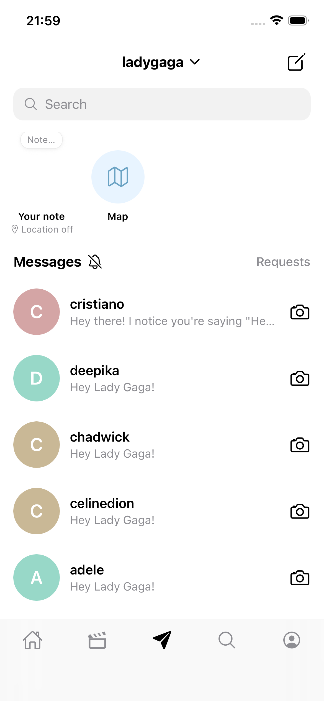
</p>
<p align="center">
  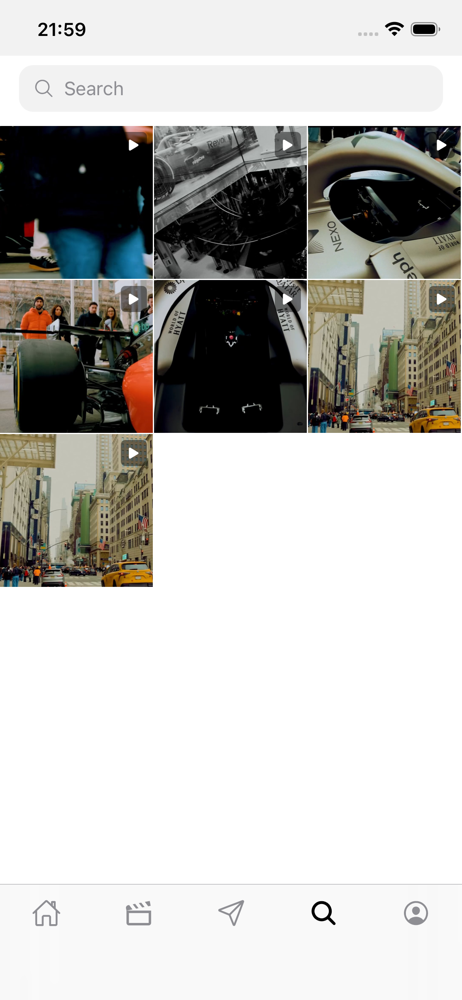
  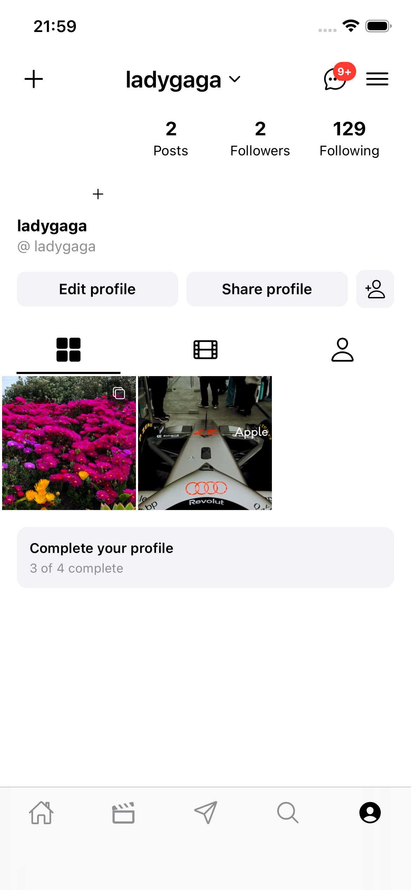
</p>
<p align="center">
  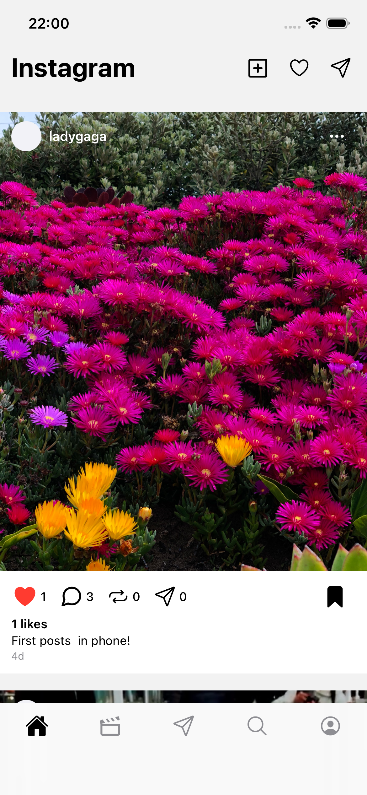
</p>

### Web 端

<p align="center">
  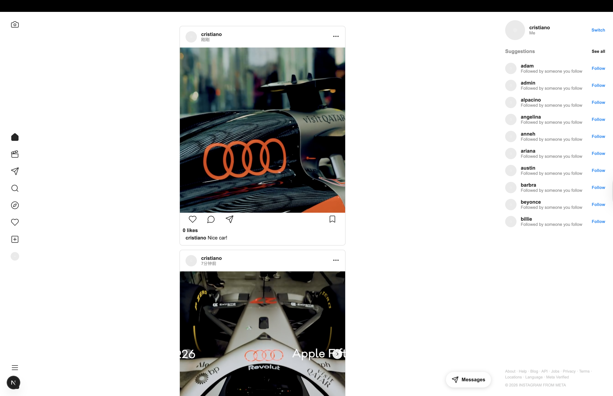
  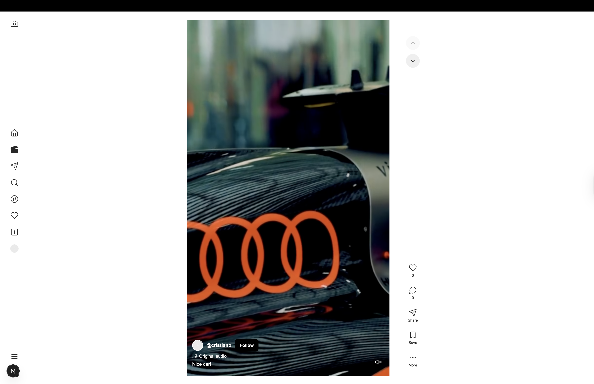
</p>
<p align="center">
  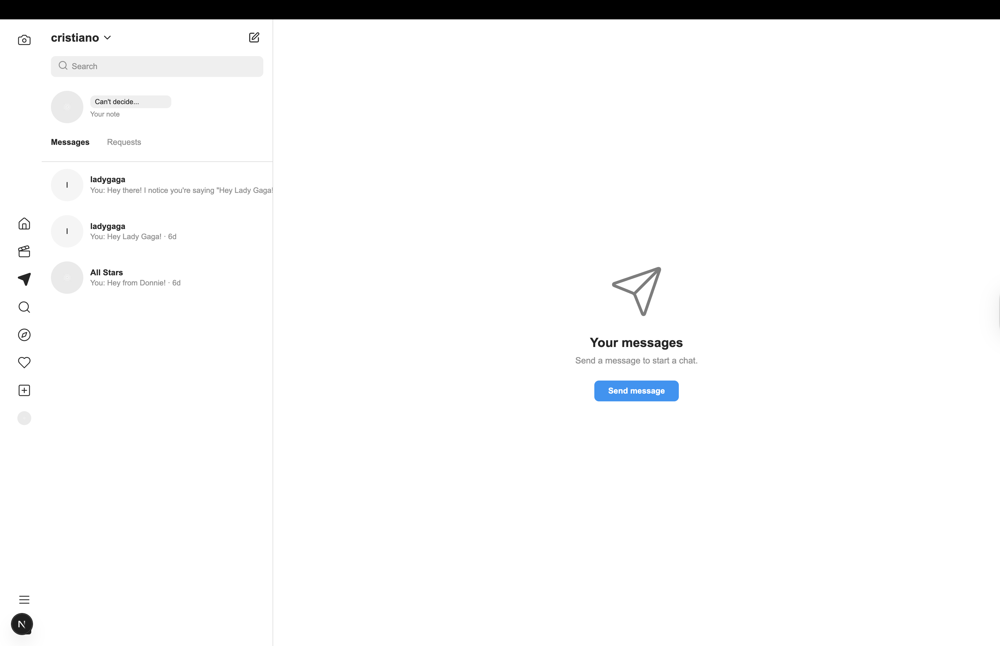
  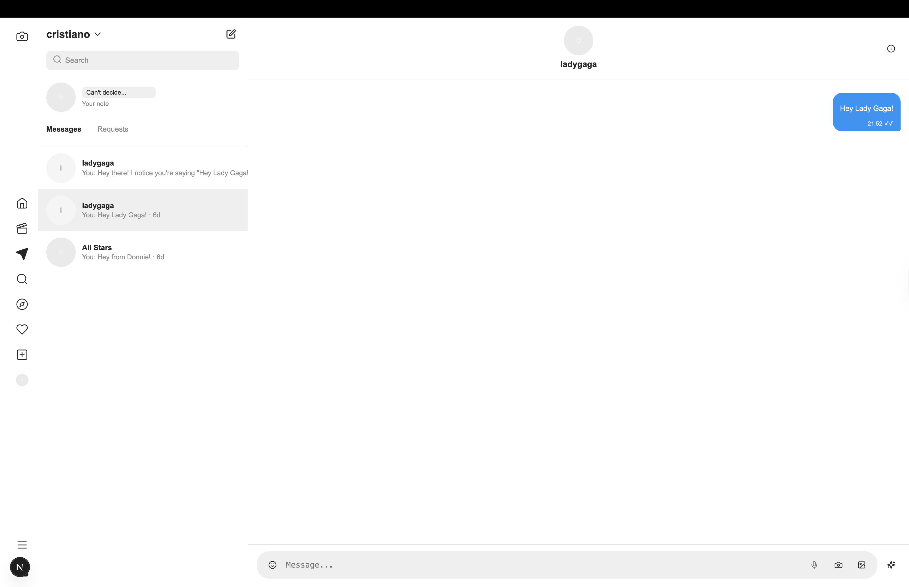
</p>
<p align="center">
  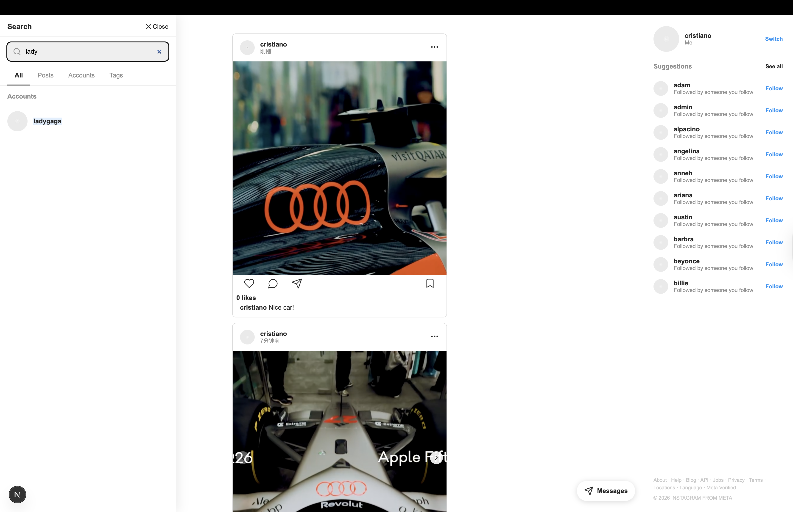
  
</p>
<p align="center">
  
  
</p>
<p align="center">
  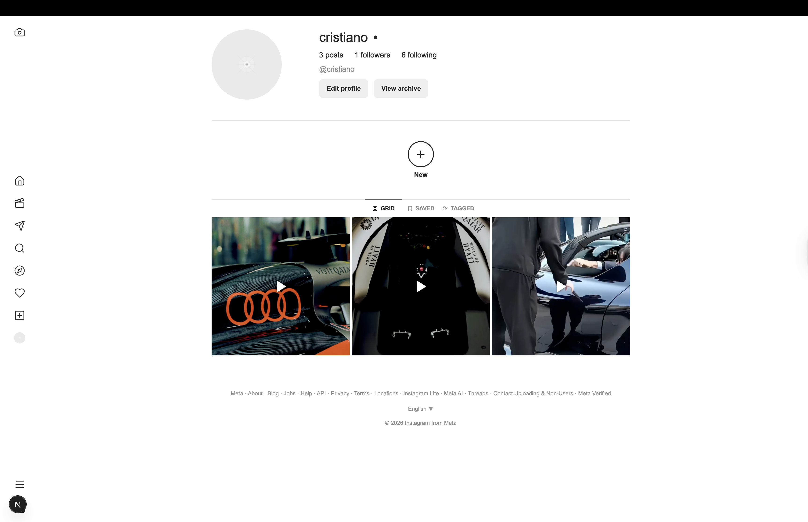
</p>

### 管理端

<p align="center">
  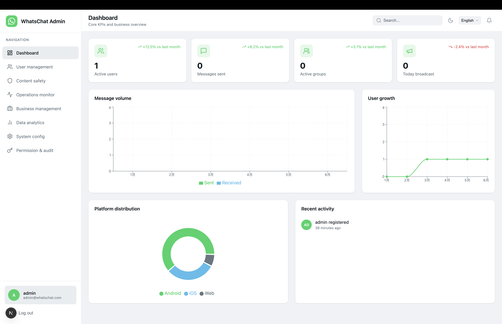
  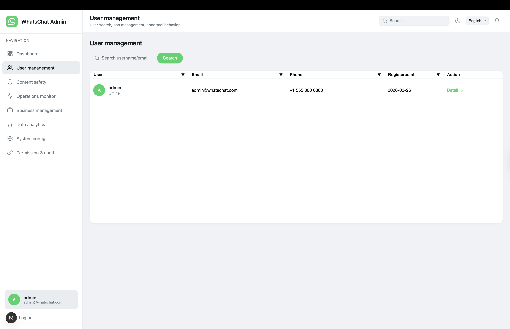
</p>

## 🛠 技术栈

- **前端** – Next.js · React · TypeScript · Emotion · Redux Toolkit · Tailwind CSS · React Native · Expo · AG Grid · Recharts · i18next
- **后端** – NestJS · Prisma · PostgreSQL · Redis · Socket.IO · Kafka · Cassandra（posts/feed/engagement/**post cover_url**）· MongoDB（comments/**activity notifications**）· Elasticsearch（search/moderation）· GraphQL（Apollo Server，code-first feed + reels 查询 + DataLoader；PostType 包含 `coverUrl`；feed/explore 可混入 organic/sponsored）
- **广告与分析** – `@whatschat/analytics` SDK（web/mobile）· NestJS 分析服务（接入 + 广告指标聚合）· Prisma 广告模型（`AdAccount`/`AdCampaign`/`AdGroup`/`AdCreative`/`AdSpend`）· feed/explore 广告投放/定向/节奏服务 · 管理端 Ads REST API
- **推荐** – Python（`services/recommendation`）· Celery（Redis broker）· LightFM · implicit（ALS）· Annoy · pandas · NumPy/SciPy；定时任务写入关注推荐与探索列表到 Redis（可选）；ETL 读取 `analytics_events`（含广告）做特征
- **视觉审核** – Python（`services/vision`）· FastAPI · NudeNet（NSFW）· ResNet50（标签）· OpenCV（视频帧）；发帖同步审核；Kafka 消费后更新 ES
- **AI / 媒体** – Ollama（文本流式）+ 自建 media-gen（Python/FastAPI：diffusers + CogVideoX + edge-tts）；图片可选 Replicate

## 🚀 快速开始

### 前置要求

- Node.js 18+
- pnpm 8+
- Docker 与 Docker Compose（`services/server/docker-compose.yml`：PostgreSQL、Redis、Kafka、Cassandra、MongoDB、Elasticsearch）

### 安装

```bash
pnpm install
pnpm setup
```

### 运行

```bash
pnpm start              # 全量：Docker + migrate + seed + search:sync-users + media-gen(:3456) + API(:3001) + Vision(:8001)
pnpm start:server       # 仅服务端：Docker(postgres/redis/kafka) + NestJS API(:3001)
pnpm start:web          # Web 应用 :4000
pnpm start:admin        # 管理端 :4001
pnpm start:mobile:ios   # 或 start:mobile:android
pnpm start:recommendation # 推荐服务 worker + Celery beat（可选，位于 services/recommendation）
```

在仓库根目录执行 `scripts/app/start.sh [dev|prod]` 可一键运行 Docker、migrate、seed、Elasticsearch 用户同步，然后启动 server（以及可选 media-gen / recommendation / Vision）。

### 环境变量

- `services/server/.env`：复制自 `services/server/.env.example`
  - **AI**：`OLLAMA_BASE_URL`、`OLLAMA_DEFAULT_MODEL`
  - **媒体（图/视频/语音）**：`MEDIA_GENERATION_API_URL`（如 `http://localhost:3456`）；或仅图片场景使用 `REPLICATE_API_TOKEN`
- **Vision（审核/标签）**：`VISION_SERVICE_URL`（默认 `http://localhost:8001`）
- `apps/web/.env.local`：`NEXT_PUBLIC_API_URL=http://localhost:3001/api/v1`、`NEXT_PUBLIC_SOCKET_IO_URL=http://localhost:3001`（可选）
- `apps/admin/.env.local`：`NEXT_PUBLIC_API_URL=http://localhost:3001/api/v1`
- `ADMIN_EMAILS=admin@whatschat.com`（逗号分隔）用于管理权限

## 📁 项目结构

```bash
apps/
  web            # Next.js Web 应用（whatschat-web, :4000），含 feed/explore 广告渲染
  admin          # 管理后台（whatschat-admin, :4001），含 Ads & Promotions 与 Shopping & Commerce
  mobile         # Expo 移动端（react-native-app）
services/
  server         # NestJS API（whatschat-server, :3001）：REST/GraphQL + 广告投放 + 分析接入 + Ads 管理 API
  media-gen      # 自建媒体生成服务（Python/FastAPI, :3456）
  recommendation # 推荐服务 + Celery + FastAPI rank(:8000)，通过 ETL 读取 analytics_events（含广告）
  vision         # 内容审核与标签推荐（Python/FastAPI, :8001）
packages/
  shared-types      # 共享类型与常量（@whatschat/shared-types）
  im                # IM 与内嵌 RTC 模块（@whatschat/im，RTC 源码在 packages/im/src/rtc）
  analytics         # 行为与广告分析 SDK（@whatschat/analytics）
services/server/src/lib/
  llm               # Ollama 聊天客户端（仅 API 服务使用）
  image-generation  # 图片生成（HTTP 任务 API 或 Replicate）
  video-generation  # 视频生成（HTTP 任务 API 或 Replicate）
```

**代码映射（C4/TOGAF）**
- API Server：`services/server`（GraphQL feed/reels、广告投放、分析接入、Ads 管理 API）
- Media Gen：`services/media-gen`
- Recommendation：`services/recommendation`（含广告 ETL）
- Vision：`services/vision`
- Web/Admin/Mobile：`apps/web`、`apps/admin`、`apps/mobile`

**共享包**
- `@whatschat/shared-types`：User/Message/Chat/Contact/Call 类型
- `@whatschat/im`：聊天 slices、hooks（`useRealChat`、`useChatsWithLiveMessages`）；RTC 与领域模型（`RTCCallState`、`ICallManager`、`useCall`、`createCallManager`、`formatDuration`、`CallManagerStub`）位于 `packages/im/src/rtc` 并由包入口重导出
- `@whatschat/analytics`：事件类型与上报 API；Web/Mobile 上报，Admin 通过 REST 读取（含 ad_impression/ad_click/ad_conversion）

**API 服务内建库**（`services/server/src/lib`，不发布为 workspace 包）
- `llm`：Ollama 聊天与流式接口
- `image-generation`：图片生成（HTTP 轮询或 Replicate）
- `video-generation`：视频生成（HTTP 轮询或 Replicate）

## 📚 文档

- [文档索引](docs/README.md)
- [C4 模型](docs/en/rd/c4/README.md) – 系统上下文、容器、组件（API/Web/Mobile/Admin/Media Gen/Recommendation/Vision）
- [TOGAF](docs/en/rd/togaf/README.md) – 业务、应用、数据、技术四大架构域

## 📄 许可证

MIT
