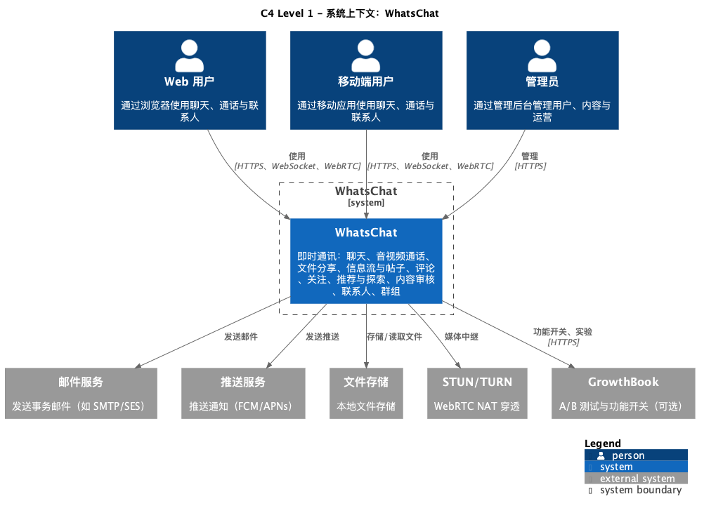
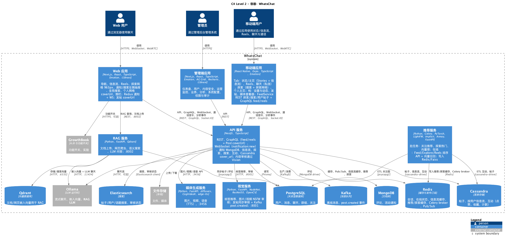
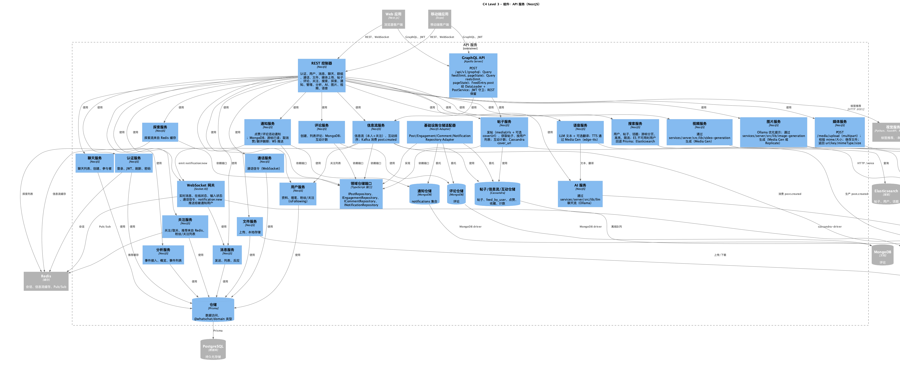
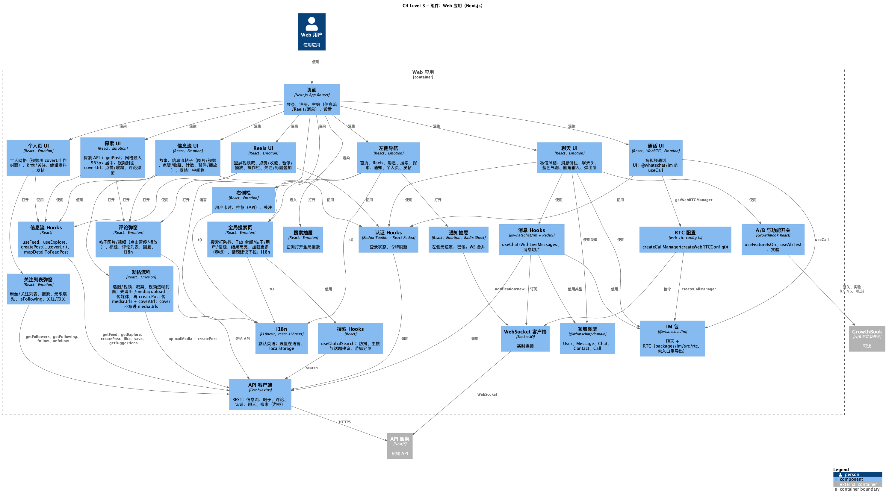
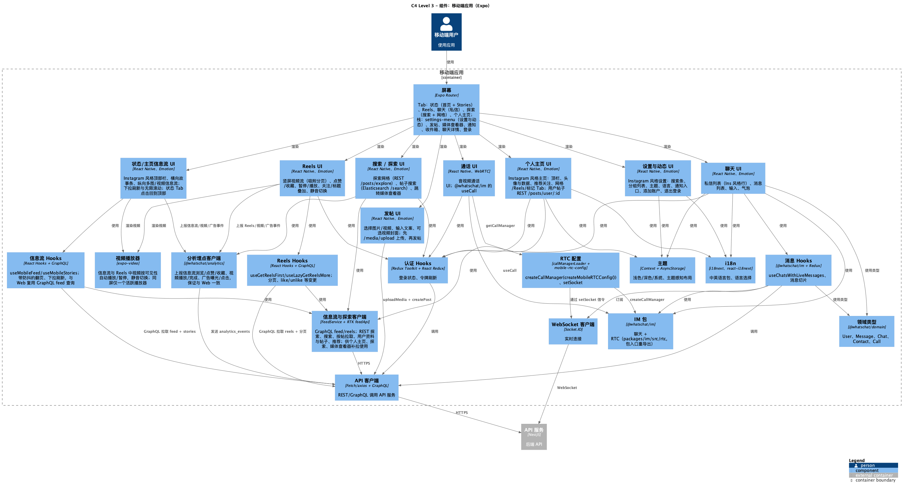
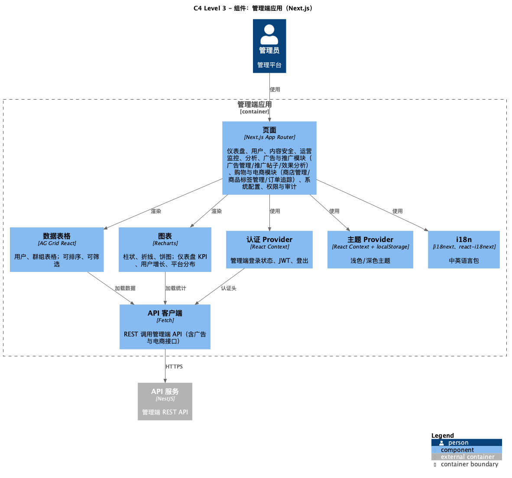

# WhatsFeed

WhatsFeed – 集即时聊天、社交动态、AI 助手与内容创作为一体的社交平台。

## 功能特性

- 💬 **实时聊天** – 基于 Socket.IO 的即时消息
- 📞 **音视频通话** – 基于 WebRTC 的语音与视频通话
- 📎 **文件分享** – 发送图片、文档与媒体文件
- 👥 **联系人管理** – 添加、搜索与管理联系人
- 🔍 **消息搜索** – 基于 Elasticsearch 的全文检索
- 🔐 **身份认证** – 基于 JWT + bcrypt 的认证体系
- 🤖 **AI 助手** – 通过 Ollama 提供流式对话
- 🖼️ **内容生成** – 图片（Stable Diffusion）、视频（CogVideoX）、语音（edge-tts）
- 📷 **动态与帖子** – 支持多图/视频发帖、评论、点赞、收藏
- 🧲 **广告系统** – 广告投放、曝光/点击/转化追踪
- 🛡️ **内容审核** – NSFW 检测、标签推荐、复审管理
- 🔎 **全局搜索** – 搜索帖子、用户、话题
- 🎯 **推荐系统** – 关注推荐、Feed 排序、探索流推荐
- 🔮 **RAG 问答** – 文档上传、语义搜索、LLM 生成答案
- 👤 **社交能力** – 关注、粉丝、个人主页
- 🌐 **Web 应用** – Next.js SPA，Instagram 风格 UI
- 📱 **移动端** – React Native + Expo，iOS/Android 双平台
- 📊 **行为分析** – 事件上报、漏斗分析、数据看板
- ⚙️ **管理后台** – 用户管理、内容审核、数据分析、系统配置

## 技术栈

### 前端
- Next.js · React · TypeScript · Emotion · Redux Toolkit
- Tailwind CSS（Web）· Bootstrap · react-bootstrap（Admin）
- lodash（Admin）· React Native · Expo · AG Grid · Recharts · i18next

### 后端
- NestJS · Prisma · PostgreSQL · Redis · Socket.IO · Kafka · Cassandra · MongoDB · Elasticsearch · GraphQL

### AI / 媒体
- Ollama（文本流式）· FastAPI · Stable Diffusion · CogVideoX · edge-tts · Qdrant

### 视觉 / 推荐
- Python 服务（Vision/Recommendation/RAG）· NudeNet · ResNet50 · LightFM · implicit · Annoy · Celery

## 项目结构

```bash
apps/
  web            # Next.js Web 应用 (:4000)
  admin          # 管理后台 (:4001)
  mobile         # Expo 移动端
services/
  server         # NestJS API (:3001)
  media-gen      # 媒体生成服务 (:3456)
  recommendation # 推荐服务 + Celery
  vision         # 内容审核服务 (:8001)
  rag            # RAG 问答服务 (:8002)
packages/
  shared-types   # 共享类型
  im             # IM 与 RTC 模块
  analytics      # 分析 SDK
```

## 截图

### 移动端

<p align="center">
  
  
  
</p>
<p align="center">
  
  
</p>

### Web 端

<p align="center">
  
  
</p>
<p align="center">
  
  
</p>
<p align="center">
  
  
</p>
<p align="center">
  
  
</p>
<p align="center">
  
</p>

### 管理端

<p align="center">
  
  
</p>

## 快速开始

### 前置要求

- Node.js 18+
- pnpm 10+
- Docker 与 Docker Compose

### 安装

```bash
pnpm install
pnpm setup
```

### 运行

```bash
pnpm start              # 全量启动
pnpm start:server       # 仅服务端
pnpm start:web          # Web 应用
pnpm start:admin        # 管理端
pnpm start:mobile:ios   # 移动端
```

### 环境变量

```bash
# services/server/.env
OLLAMA_BASE_URL=http://localhost:11434
OLLAMA_DEFAULT_MODEL=llama3
MEDIA_GENERATION_API_URL=http://localhost:3456
VISION_SERVICE_URL=http://localhost:8001
RAG_SERVICE_URL=http://localhost:8002

# apps/web/.env.local
NEXT_PUBLIC_API_URL=http://localhost:3001/api/v1

# apps/admin/.env.local
NEXT_PUBLIC_API_URL=http://localhost:3001/api/v1
ADMIN_EMAILS=admin@whatschat.com
```

## C4 模型架构图

WhatsFeed 采用 C4 模型进行架构可视化设计，从系统上下文、容器、组件三个层级描述系统架构。

### C1 系统上下文图



### C2 容器图



### C3 组件图

#### API Server



#### Web App



#### Mobile App



#### Admin App



## 文档

- [文档索引](docs/README.md)
- [C4 模型（中文）](docs/zh/rd/c4/README.md)
- [C4 Model (English)](docs/en/rd/c4/README.md)
- [TOGAF](docs/en/rd/togaf/README.md)

## Clean Architecture（2026-04）

服务端已采用端口-适配器模式：

- **端口接口**：`IPostRepository`、`IEngagementRepository`、`ICommentRepository`、`INotificationRepository`
- **适配器实现**：`PostRepositoryAdapter`、`EngagementRepositoryAdapter`、`CommentRepositoryAdapter`、`NotificationRepositoryAdapter`
- **依赖注入**：通过 `@Inject("I...Repository")` 解耦，数据存储可替换（Cassandra/MongoDB）

## 许可证

MIT
