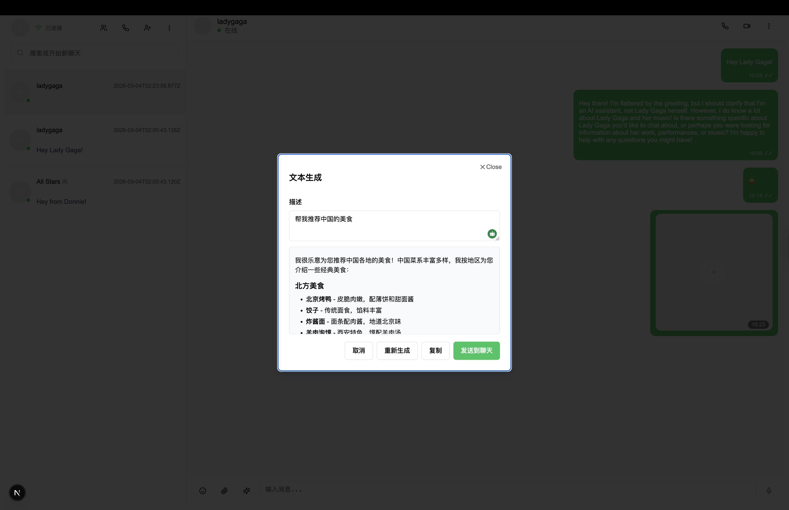
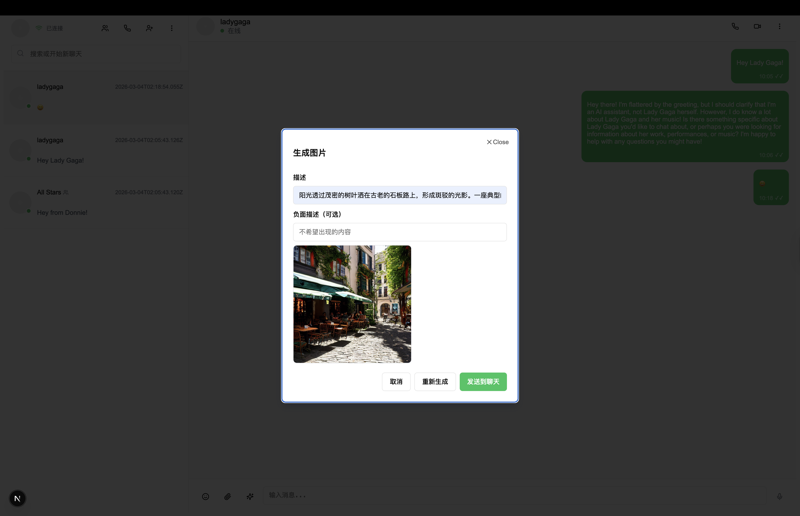
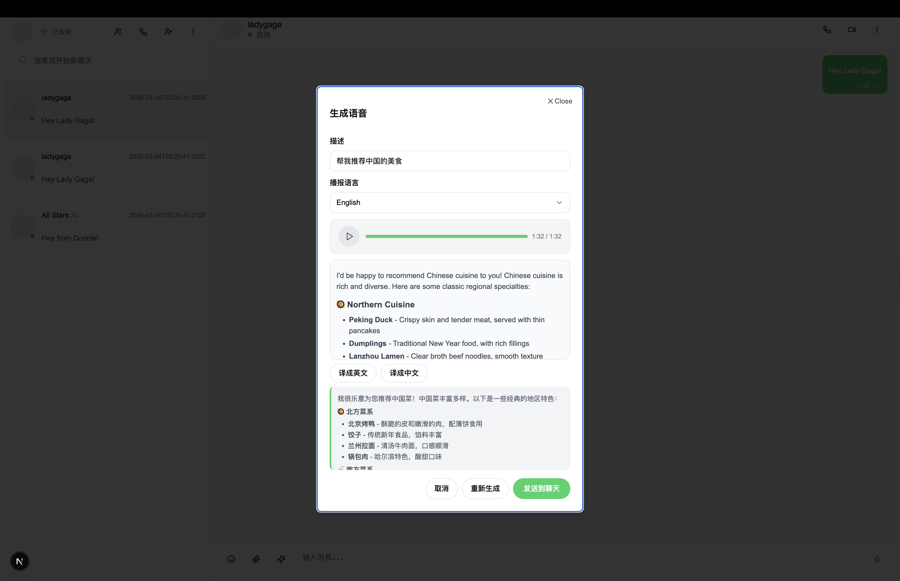

# WhatsChat

A modern instant messaging application with real-time chat, voice/video calls, and file sharing.

## ✨ Features

- 💬 **Real-time Chat** – Instant messaging with Socket.IO (real connection only)
- 📞 **Voice/Video Calls** – WebRTC-based audio and video
- 📎 **File Sharing** – Send images, documents, and media
- 👥 **Contact Management** – Add, search, and manage contacts
- 🔍 **Message Search** – Full-text search powered by Elasticsearch
- 🔐 **Authentication** – JWT-based auth with bcrypt
- 🤖 **AI Text** – Streaming chat via Ollama (configurable base URL/model)
- 🖼️ **Image / Video / Voice** – One self-hosted service (apps/media-gen, :3456): image (Stable Diffusion), video (CogVideoX), voice (edge-tts, optional translation & markdown in dialog); or Replicate for image only
- 📷 **Feed & Posts** – Create posts with multiple photos/videos + caption; home feed shows real posts from followed users (no mock; Cassandra + Kafka post.created); Reels and profile grid; multi-media carousel on feed and in comments dialog; comments in MongoDB; search in Elasticsearch
- 🎯 **Recommendations** – Follow suggestions, engagement-based feed ranking, and explore stream backed by a Python recommendation service (LightFM, implicit ALS + Annoy) with Celery workers, Redis caches, Kafka/PostgreSQL/Cassandra data
- 👤 **Social** – Follow/unfollow, profile followers/following counts and list modals with infinite scroll and inline follow/unfollow
- 🌐 **Web App** – Next.js SPA (:4000); Instagram-style UI (nav, feed, Reels, profile, DM-style messages, right sidebar suggestions), i18n (en/zh, footer language switch)
- 📱 **Mobile App** – React Native + Expo
- 📊 **Behavior Analytics** – SDK in `@whatschat/analytics`; Web/Mobile track events (including post view/like/save); API ingests; Admin shows overview
- ⚙️ **Admin Dashboard** – Dashboard, Users, Content Safety, Ops Monitor, Business, Data Analytics, System Config, Permission & Audit (port 4001)

## 📸 Screenshots

### Mobile

<p align="center">
  
  
  
</p>
<p align="center">
  
  
  
</p>

### Web

<p align="center">
  
  
  
  
</p>
<p align="center">
  
  
  
</p>

### Admin

<p align="center">
  
  
</p>

## 🛠 Tech Stack

- **Frontend** – Next.js · React · TypeScript · Emotion · Redux Toolkit · Tailwind CSS · React Native · Expo · AG Grid · Recharts · i18next
- **Backend** – NestJS · Prisma · PostgreSQL · Redis · Socket.IO · Kafka · Cassandra (posts, feed, engagement) · MongoDB (comments) · Elasticsearch (search)
- **Recommendations** – Python (apps/recommendation) · Celery (Redis broker) · LightFM · implicit (ALS) · Annoy · pandas · NumPy/SciPy; scheduled jobs generate follow suggestions and explore lists into Redis
- **AI / Media** – Ollama (text stream), self-hosted media-gen (Python/FastAPI: diffusers + CogVideoX + edge-tts for image/video/voice); optional Replicate for image

## 🚀 Quick Start

### Prerequisites

- Node.js 18+
- pnpm 8+
- Docker & Docker Compose (PostgreSQL, Redis, Kafka, Cassandra, MongoDB, Elasticsearch via `apps/server/docker-compose.yml`)

### Setup

```bash
pnpm install
pnpm setup
```

### Run

```bash
pnpm start           # Full: Docker + media-gen (:3456) + API (:3001)
pnpm start:server    # Docker (postgres/redis/kafka) + NestJS API (:3001) only
pnpm start:web       # Web app on :4000
pnpm start:admin     # Admin dashboard on :4001
pnpm start:mobile:ios   # or start:mobile:android
pnpm start:recommendation # Python recommendation worker + Celery beat (optional, runs in apps/recommendation)
```

### Environment

- `apps/server/.env` – Copy from `apps/server/.env.example`
  - **AI**: `OLLAMA_BASE_URL`, `OLLAMA_DEFAULT_MODEL`
  - **Media** (image + video + voice): `MEDIA_GENERATION_API_URL` (e.g. `http://localhost:3456` for apps/media-gen); or `REPLICATE_API_TOKEN` for image only
- `apps/web/.env.local` – `NEXT_PUBLIC_API_URL=http://localhost:3001/api/v1`, `NEXT_PUBLIC_SOCKET_IO_URL=http://localhost:3001` (optional, for Socket.IO)
- `apps/admin/.env.local` – `NEXT_PUBLIC_API_URL=http://localhost:3001/api/v1`
- `ADMIN_EMAILS=admin@whatschat.com` (comma-separated) for admin access

## 📁 Project Structure

```
apps/
  web        # Next.js web app, Instagram-style UI + i18n (whatschat-web, :4000)
  admin      # Admin dashboard (whatschat-admin, :4001)
  mobile     # Expo mobile app (react-native-app)
  server     # NestJS API (whatschat-server, :3001)
  media-gen  # Self-hosted image + video + voice (Python/FastAPI, :3456)
packages/
  domain           # Shared types and constants (@whatschat/domain)
  im               # Instant messaging + RTC (@whatschat/im)
  rtc              # Voice/video call logic (@whatschat/rtc, used by im)
  analytics        # Behavior analytics SDK (@whatschat/analytics)
  llm              # LLM client (Ollama stream, used by server)
  image-generation # Image client (HTTP job API or Replicate, used by server)
  video-generation # Video client (HTTP job API, used by server)
```

**Shared packages:**
- `@whatschat/domain` – User, Message, Chat, Contact, Call types
- `@whatschat/im` – Chat slices, hooks (useRealChat, useChatsWithLiveMessages), RTC (useCall, createCallManager). Apps inject platform adapters.
- `@whatschat/rtc` – RTC domain (RTCCallState, ICallManager), config-driven createCallManager, formatDuration, CallManagerStub.
- `@whatschat/analytics` – Event types, track/identify API; Web/Mobile send events to API; Admin reads via REST.
- `@whatschat/llm` – Ollama streaming chat client.
- `@whatschat/image-generation` – Image generation: HTTP client (jobId poll) or Replicate adapter.
- `@whatschat/video-generation` – Video generation: HTTP client (jobId poll).

## 📚 Docs

- [Docs index](docs/README.md)
- [C4 Model](docs/en/rd/c4/README.md) – System context, containers, components (API, Web, Mobile, Admin); feed from followed users, multi-media posts
- [TOGAF](docs/en/rd/togaf/README.md) – Business, Application, Data, Technology (four architecture domains)

## 📄 License

MIT
