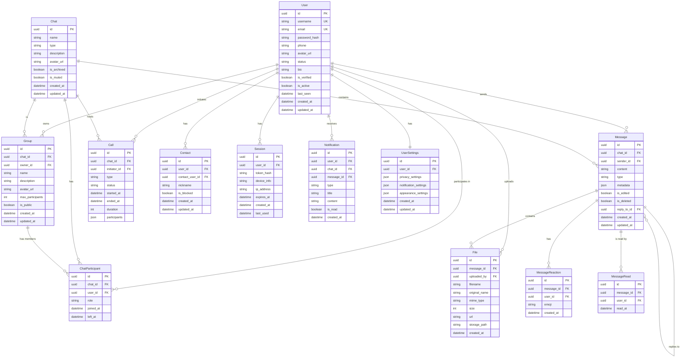

# WhatsChat 数据库设计文档

本文档详细描述了 WhatsChat 项目的数据库设计，包括实体关系图(ER图)、数据模型定义和数据库约束。

## 📊 实体关系图 (ER Diagram)



## 🗄️ 数据模型详细说明

### 核心实体

#### User (用户)

```sql
CREATE TABLE users (
    id UUID PRIMARY KEY DEFAULT gen_random_uuid(),
    username VARCHAR(20) UNIQUE NOT NULL,
    email VARCHAR(255) UNIQUE NOT NULL,
    password_hash VARCHAR(255) NOT NULL,
    phone VARCHAR(20),
    avatar_url TEXT,
    status VARCHAR(50) DEFAULT 'offline',
    bio TEXT,
    is_verified BOOLEAN DEFAULT FALSE,
    is_active BOOLEAN DEFAULT TRUE,
    last_seen TIMESTAMP,
    created_at TIMESTAMP DEFAULT NOW(),
    updated_at TIMESTAMP DEFAULT NOW()
);

-- 索引
CREATE INDEX idx_users_email ON users(email);
CREATE INDEX idx_users_username ON users(username);
CREATE INDEX idx_users_status ON users(status);
CREATE INDEX idx_users_last_seen ON users(last_seen);
```

#### Chat (聊天)

```sql
CREATE TABLE chats (
    id UUID PRIMARY KEY DEFAULT gen_random_uuid(),
    name VARCHAR(100),
    type VARCHAR(20) NOT NULL CHECK (type IN ('private', 'group')),
    description TEXT,
    avatar_url TEXT,
    is_archived BOOLEAN DEFAULT FALSE,
    is_muted BOOLEAN DEFAULT FALSE,
    created_at TIMESTAMP DEFAULT NOW(),
    updated_at TIMESTAMP DEFAULT NOW()
);

-- 索引
CREATE INDEX idx_chats_type ON chats(type);
CREATE INDEX idx_chats_created_at ON chats(created_at);
```

#### Message (消息)

```sql
CREATE TABLE messages (
    id UUID PRIMARY KEY DEFAULT gen_random_uuid(),
    chat_id UUID NOT NULL REFERENCES chats(id) ON DELETE CASCADE,
    sender_id UUID NOT NULL REFERENCES users(id) ON DELETE CASCADE,
    content TEXT NOT NULL,
    type VARCHAR(20) NOT NULL CHECK (type IN ('text', 'image', 'video', 'audio', 'file', 'location')),
    metadata JSONB,
    is_edited BOOLEAN DEFAULT FALSE,
    is_deleted BOOLEAN DEFAULT FALSE,
    reply_to_id UUID REFERENCES messages(id),
    created_at TIMESTAMP DEFAULT NOW(),
    updated_at TIMESTAMP DEFAULT NOW()
);

-- 索引
CREATE INDEX idx_messages_chat_id ON messages(chat_id);
CREATE INDEX idx_messages_sender_id ON messages(sender_id);
CREATE INDEX idx_messages_created_at ON messages(created_at);
CREATE INDEX idx_messages_type ON messages(type);
CREATE INDEX idx_messages_reply_to_id ON messages(reply_to_id);
```

#### ChatParticipant (聊天参与者)

```sql
CREATE TABLE chat_participants (
    id UUID PRIMARY KEY DEFAULT gen_random_uuid(),
    chat_id UUID NOT NULL REFERENCES chats(id) ON DELETE CASCADE,
    user_id UUID NOT NULL REFERENCES users(id) ON DELETE CASCADE,
    role VARCHAR(20) DEFAULT 'member' CHECK (role IN ('owner', 'admin', 'member')),
    joined_at TIMESTAMP DEFAULT NOW(),
    left_at TIMESTAMP,
    UNIQUE(chat_id, user_id)
);

-- 索引
CREATE INDEX idx_chat_participants_chat_id ON chat_participants(chat_id);
CREATE INDEX idx_chat_participants_user_id ON chat_participants(user_id);
CREATE INDEX idx_chat_participants_role ON chat_participants(role);
```

### 扩展实体

#### Group (群组)

```sql
CREATE TABLE groups (
    id UUID PRIMARY KEY DEFAULT gen_random_uuid(),
    chat_id UUID NOT NULL REFERENCES chats(id) ON DELETE CASCADE,
    owner_id UUID NOT NULL REFERENCES users(id) ON DELETE CASCADE,
    name VARCHAR(100) NOT NULL,
    description TEXT,
    avatar_url TEXT,
    max_participants INTEGER DEFAULT 500,
    is_public BOOLEAN DEFAULT FALSE,
    created_at TIMESTAMP DEFAULT NOW(),
    updated_at TIMESTAMP DEFAULT NOW()
);

-- 索引
CREATE INDEX idx_groups_chat_id ON groups(chat_id);
CREATE INDEX idx_groups_owner_id ON groups(owner_id);
CREATE INDEX idx_groups_is_public ON groups(is_public);
```

#### Call (通话)

```sql
CREATE TABLE calls (
    id UUID PRIMARY KEY DEFAULT gen_random_uuid(),
    chat_id UUID NOT NULL REFERENCES chats(id) ON DELETE CASCADE,
    initiator_id UUID NOT NULL REFERENCES users(id) ON DELETE CASCADE,
    type VARCHAR(10) NOT NULL CHECK (type IN ('audio', 'video')),
    status VARCHAR(20) NOT NULL CHECK (status IN ('initiated', 'ringing', 'answered', 'ended', 'missed')),
    started_at TIMESTAMP DEFAULT NOW(),
    ended_at TIMESTAMP,
    duration INTEGER, -- 秒
    participants JSONB NOT NULL DEFAULT '[]'::jsonb
);

-- 索引
CREATE INDEX idx_calls_chat_id ON calls(chat_id);
CREATE INDEX idx_calls_initiator_id ON calls(initiator_id);
CREATE INDEX idx_calls_status ON calls(status);
CREATE INDEX idx_calls_started_at ON calls(started_at);
```

#### File (文件)

```sql
CREATE TABLE files (
    id UUID PRIMARY KEY DEFAULT gen_random_uuid(),
    message_id UUID REFERENCES messages(id) ON DELETE CASCADE,
    uploaded_by UUID NOT NULL REFERENCES users(id) ON DELETE CASCADE,
    filename VARCHAR(255) NOT NULL,
    original_name VARCHAR(255) NOT NULL,
    mime_type VARCHAR(100) NOT NULL,
    size BIGINT NOT NULL,
    url TEXT NOT NULL,
    storage_path TEXT NOT NULL,
    created_at TIMESTAMP DEFAULT NOW()
);

-- 索引
CREATE INDEX idx_files_message_id ON files(message_id);
CREATE INDEX idx_files_uploaded_by ON files(uploaded_by);
CREATE INDEX idx_files_mime_type ON files(mime_type);
CREATE INDEX idx_files_created_at ON files(created_at);
```

#### Contact (联系人)

```sql
CREATE TABLE contacts (
    id UUID PRIMARY KEY DEFAULT gen_random_uuid(),
    user_id UUID NOT NULL REFERENCES users(id) ON DELETE CASCADE,
    contact_user_id UUID NOT NULL REFERENCES users(id) ON DELETE CASCADE,
    nickname VARCHAR(50),
    is_blocked BOOLEAN DEFAULT FALSE,
    created_at TIMESTAMP DEFAULT NOW(),
    updated_at TIMESTAMP DEFAULT NOW(),
    UNIQUE(user_id, contact_user_id)
);

-- 索引
CREATE INDEX idx_contacts_user_id ON contacts(user_id);
CREATE INDEX idx_contacts_contact_user_id ON contacts(contact_user_id);
CREATE INDEX idx_contacts_is_blocked ON contacts(is_blocked);
```

### 辅助实体

#### Session (会话)

```sql
CREATE TABLE sessions (
    id UUID PRIMARY KEY DEFAULT gen_random_uuid(),
    user_id UUID NOT NULL REFERENCES users(id) ON DELETE CASCADE,
    token_hash VARCHAR(255) NOT NULL,
    device_info TEXT,
    ip_address INET,
    expires_at TIMESTAMP NOT NULL,
    created_at TIMESTAMP DEFAULT NOW(),
    last_used TIMESTAMP DEFAULT NOW()
);

-- 索引
CREATE INDEX idx_sessions_user_id ON sessions(user_id);
CREATE INDEX idx_sessions_token_hash ON sessions(token_hash);
CREATE INDEX idx_sessions_expires_at ON sessions(expires_at);
```

#### Notification (通知)

```sql
CREATE TABLE notifications (
    id UUID PRIMARY KEY DEFAULT gen_random_uuid(),
    user_id UUID NOT NULL REFERENCES users(id) ON DELETE CASCADE,
    chat_id UUID REFERENCES chats(id) ON DELETE CASCADE,
    message_id UUID REFERENCES messages(id) ON DELETE CASCADE,
    type VARCHAR(50) NOT NULL,
    title VARCHAR(255) NOT NULL,
    content TEXT NOT NULL,
    is_read BOOLEAN DEFAULT FALSE,
    created_at TIMESTAMP DEFAULT NOW()
);

-- 索引
CREATE INDEX idx_notifications_user_id ON notifications(user_id);
CREATE INDEX idx_notifications_is_read ON notifications(is_read);
CREATE INDEX idx_notifications_created_at ON notifications(created_at);
```

#### UserSettings (用户设置)

```sql
CREATE TABLE user_settings (
    id UUID PRIMARY KEY DEFAULT gen_random_uuid(),
    user_id UUID NOT NULL REFERENCES users(id) ON DELETE CASCADE,
    privacy_settings JSONB DEFAULT '{}'::jsonb,
    notification_settings JSONB DEFAULT '{}'::jsonb,
    appearance_settings JSONB DEFAULT '{}'::jsonb,
    created_at TIMESTAMP DEFAULT NOW(),
    updated_at TIMESTAMP DEFAULT NOW(),
    UNIQUE(user_id)
);

-- 索引
CREATE INDEX idx_user_settings_user_id ON user_settings(user_id);
```

#### MessageReaction (消息反应)

```sql
CREATE TABLE message_reactions (
    id UUID PRIMARY KEY DEFAULT gen_random_uuid(),
    message_id UUID NOT NULL REFERENCES messages(id) ON DELETE CASCADE,
    user_id UUID NOT NULL REFERENCES users(id) ON DELETE CASCADE,
    emoji VARCHAR(10) NOT NULL,
    created_at TIMESTAMP DEFAULT NOW(),
    UNIQUE(message_id, user_id, emoji)
);

-- 索引
CREATE INDEX idx_message_reactions_message_id ON message_reactions(message_id);
CREATE INDEX idx_message_reactions_user_id ON message_reactions(user_id);
```

#### MessageRead (消息已读)

```sql
CREATE TABLE message_reads (
    id UUID PRIMARY KEY DEFAULT gen_random_uuid(),
    message_id UUID NOT NULL REFERENCES messages(id) ON DELETE CASCADE,
    user_id UUID NOT NULL REFERENCES users(id) ON DELETE CASCADE,
    read_at TIMESTAMP DEFAULT NOW(),
    UNIQUE(message_id, user_id)
);

-- 索引
CREATE INDEX idx_message_reads_message_id ON message_reads(message_id);
CREATE INDEX idx_message_reads_user_id ON message_reads(user_id);
CREATE INDEX idx_message_reads_read_at ON message_reads(read_at);
```

## 🔗 关系说明

### 一对多关系

1. **User → Messages**: 一个用户可以发送多条消息
2. **User → Chats**: 一个用户可以参与多个聊天
3. **Chat → Messages**: 一个聊天可以包含多条消息
4. **Chat → Participants**: 一个聊天可以有多个参与者
5. **Message → Files**: 一条消息可以包含多个文件
6. **Message → Reactions**: 一条消息可以有多个反应
7. **Message → Reads**: 一条消息可以被多个用户阅读

### 多对多关系

1. **Users ↔ Chats**: 通过 `chat_participants` 表实现
2. **Users ↔ Contacts**: 通过 `contacts` 表实现

### 一对一关系

1. **User ↔ UserSettings**: 每个用户有唯一的设置
2. **Chat ↔ Group**: 每个群组对应一个聊天

## 📊 数据库约束

### 主键约束

- 所有表都使用 UUID 作为主键
- 使用 `gen_random_uuid()` 生成唯一标识符

### 外键约束

- 所有外键都设置了 `ON DELETE CASCADE`
- 确保数据一致性

### 唯一约束

- `users.email` 和 `users.username` 必须唯一
- `chat_participants(chat_id, user_id)` 组合唯一
- `contacts(user_id, contact_user_id)` 组合唯一
- `user_settings.user_id` 唯一
- `message_reactions(message_id, user_id, emoji)` 组合唯一
- `message_reads(message_id, user_id)` 组合唯一

### 检查约束

- `chats.type` 只能是 'private' 或 'group'
- `messages.type` 限制在预定义的类型中
- `chat_participants.role` 限制在预定义的角色中
- `calls.type` 只能是 'audio' 或 'video'
- `calls.status` 限制在预定义的状态中

## 🔍 查询优化

### 常用查询模式

#### 1. 获取用户聊天列表

```sql
SELECT DISTINCT c.*,
       cp.joined_at,
       m.content as last_message,
       m.created_at as last_message_time
FROM chats c
JOIN chat_participants cp ON c.id = cp.chat_id
LEFT JOIN messages m ON c.id = m.chat_id
WHERE cp.user_id = $1
  AND m.created_at = (
    SELECT MAX(created_at)
    FROM messages
    WHERE chat_id = c.id
  )
ORDER BY last_message_time DESC;
```

#### 2. 获取聊天消息

```sql
SELECT m.*, u.username, u.avatar_url
FROM messages m
JOIN users u ON m.sender_id = u.id
WHERE m.chat_id = $1
  AND m.is_deleted = FALSE
ORDER BY m.created_at ASC
LIMIT $2 OFFSET $3;
```

#### 3. 获取未读消息数量

```sql
SELECT COUNT(*) as unread_count
FROM messages m
JOIN chat_participants cp ON m.chat_id = cp.chat_id
LEFT JOIN message_reads mr ON m.id = mr.message_id AND mr.user_id = cp.user_id
WHERE cp.user_id = $1
  AND m.sender_id != $1
  AND mr.id IS NULL;
```

### 性能优化建议

1. **分页查询**: 使用 `LIMIT` 和 `OFFSET` 进行分页
2. **索引优化**: 为常用查询字段创建索引
3. **查询缓存**: 使用 Redis 缓存频繁查询的结果
4. **读写分离**: 读操作使用从库，写操作使用主库
5. **数据归档**: 定期归档历史消息数据

## 🛠️ 数据库迁移

### 初始迁移

```sql
-- 创建扩展
CREATE EXTENSION IF NOT EXISTS "uuid-ossp";

-- 创建表
-- (按照上面的 CREATE TABLE 语句执行)

-- 创建触发器
CREATE OR REPLACE FUNCTION update_updated_at_column()
RETURNS TRIGGER AS $$
BEGIN
    NEW.updated_at = NOW();
    RETURN NEW;
END;
$$ language 'plpgsql';

-- 为需要的表添加触发器
CREATE TRIGGER update_users_updated_at BEFORE UPDATE ON users
    FOR EACH ROW EXECUTE FUNCTION update_updated_at_column();
```

### 数据迁移脚本

```sql
-- 示例：添加新字段
ALTER TABLE users ADD COLUMN last_seen TIMESTAMP;

-- 示例：创建索引
CREATE INDEX CONCURRENTLY idx_users_last_seen ON users(last_seen);

-- 示例：更新数据
UPDATE users SET last_seen = NOW() WHERE last_seen IS NULL;
```

## 📈 数据增长策略

### 分区策略

```sql
-- 按时间分区消息表
CREATE TABLE messages_2024_01 PARTITION OF messages
FOR VALUES FROM ('2024-01-01') TO ('2024-02-01');

CREATE TABLE messages_2024_02 PARTITION OF messages
FOR VALUES FROM ('2024-02-01') TO ('2024-03-01');
```

### 数据归档

```sql
-- 归档6个月前的消息
INSERT INTO messages_archive
SELECT * FROM messages
WHERE created_at < NOW() - INTERVAL '6 months';

DELETE FROM messages
WHERE created_at < NOW() - INTERVAL '6 months';
```

## 🔒 数据安全

### 数据加密

- 密码使用 bcrypt 哈希
- 敏感数据使用 AES-256 加密
- 文件存储使用加密存储

### 访问控制

- 使用行级安全策略 (RLS)
- 基于角色的访问控制 (RBAC)
- API 级别的权限验证

### 备份策略

- 每日增量备份
- 每周完整备份
- 异地备份存储
- 定期恢复测试

## 📋 数据库维护

### 定期维护任务

1. **统计信息更新**: `ANALYZE` 命令
2. **索引重建**: `REINDEX` 命令
3. **垃圾回收**: `VACUUM` 命令
4. **日志轮转**: 配置日志文件大小限制

### 监控指标

- 连接数
- 查询性能
- 磁盘使用率
- 锁等待时间
- 慢查询日志

---
