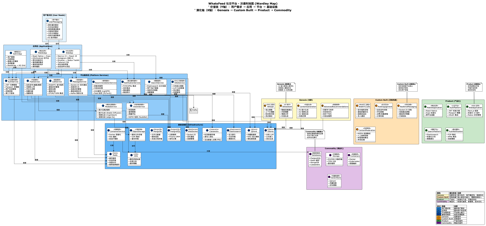

# WhatsFeed 沃德利地图 (Wardley Map)

本文件夹包含 WhatsFeed 社交平台的沃德利地图文档。

## 沃德利地图



## 📊 沃德利地图简介

沃德利地图（Wardley Map）是一种战略地图工具，用于可视化系统组件在价值链和演化轴上的位置，帮助理解：

- **价值链（Y轴）**：从用户需求到基础设施的垂直分层
- **演化阶段（X轴）**：从创新（Genesis）到商品（Commodity）的水平演进

## 🎯 使用场景

### 技术选型决策

识别哪些组件应该自建，哪些应该使用现成产品

### 架构演进规划

理解组件从创新到商品的演进路径

### 成本优化分析

识别可以商品化的组件以降低成本

### 竞争优势识别

明确哪些是差异化能力，哪些是通用能力

## 📈 地图结构

### 价值链分层（Y轴）

1. **用户需求层**：即时通讯、社交动态、音视频通话、内容创作、文件分享、发现推荐、AI 助手
2. **应用层**：Web 应用、移动应用、管理后台
3. **平台服务层**：消息服务、认证授权、通话服务、内容服务、媒体处理、搜索服务、推送通知、推荐服务、内容审核、RAG 问答
4. **基础设施层**：PostgreSQL、Redis、Cassandra、MongoDB、Elasticsearch、对象存储、CDN、WebSocket、容器服务、Qdrant、Ollama

### 演化阶段（X轴）

- **Genesis (创新)**：AI 助手、内容生成、RAG 问答、高级推荐
- **Custom Built (定制构建)**：实时消息、WebRTC 通话、社交互动、内容审核
- **Product (产品化)**：Web 应用、移动应用、认证平台、搜索平台、推送通知
- **Commodity (商品化)**：数据库服务、存储服务、容器服务、向量数据库

## 🔧 如何查看

### 方法一：在线查看

1. 访问 [PlantUML 在线编辑器](https://www.plantuml.com/plantuml/uml/)
2. 将 `wardley-map.puml` 文件内容复制到编辑器中
3. 点击 "Submit" 生成图片

### 方法二：使用 VS Code 插件

1. 安装 [PlantUML 插件](https://marketplace.visualstudio.com/items?itemName=jebbs.plantuml)
2. 在 VS Code 中打开 `wardley-map.puml` 文件
3. 按 `Alt+D` 预览图片

### 方法三：本地安装 PlantUML

```bash
# 安装 Java (如果未安装)
brew install java

# 安装 PlantUML
brew install plantuml

# 生成 PNG 图片
plantuml docs/zh/product/wardley-map/wardley-map.puml

# 生成 SVG 图片
plantuml -tsvg docs/zh/product/wardley-map/wardley-map.puml
```

## 📚 相关文档

- [架构设计文档](../rd/c4/) - 查看 C4 架构图
- [项目文档首页](../README.md) - 返回文档首页

## 🔗 参考资源

- [Wardley Maps 官方网站](https://wardleymaps.com/)
- [Wardley Maps 教程](https://learnwardleymapping.com/)
- [PlantUML 官方网站](https://plantuml.com/)

---

[English](../../en/product/wardley-map/README.md)

最后更新时间：2026年5月
